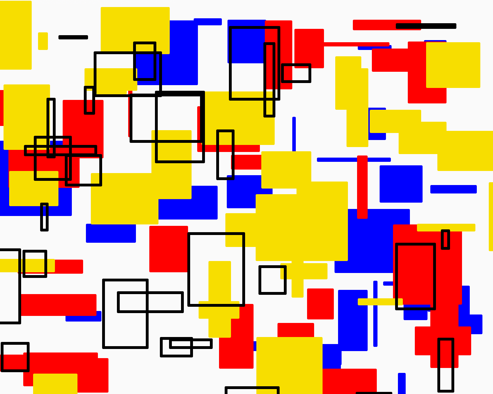
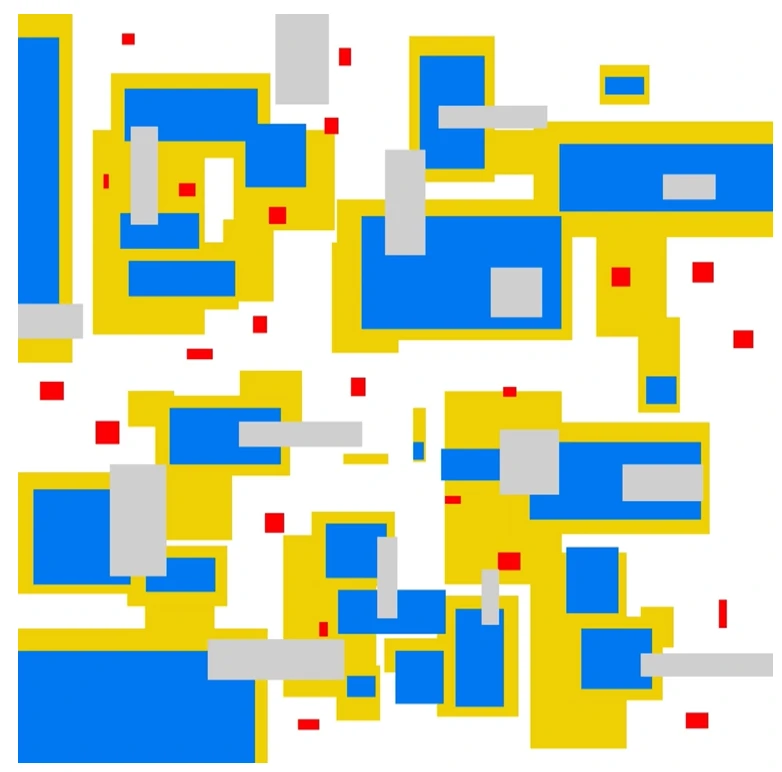

# zixu0859_9103_GroupD

## 1. Instructions for Interaction
1. **Hover Effect**: Blocks expand to three times their original size when hovered, drawing user attention to the selected block.
2. **Click Interaction**: Clicking a block changes its color to a random RGB value, adding an element of unpredictability.
3. **Drag and Drop**: 
   - Blocks can be dragged around the canvas.
   - While dragging, the block continuously changes color and leaves a fading shadow trail, simulating motion blur.
4. **Double-click Reset**: Double-clicking a block resets it to its original position on the canvas.

## 2. Details of my individual work
_In my approach, I focused on enhancing the **interactivity** and **visual appeal** of the animation. By emphasizing **color and size transformations** combined with a smooth shadow-trail effect, my approach aims to create a sense of depth and movement, making the blocks feel alive and responsive to user actions._
### How My Animation Differs from Other Group Members
- My animation is to move the elements by using the mouse, allowing me to shift or reposition shapes directly based on my interactions.
- Yueying Wang controls the size of the elements based on sound input, allowing the shapes to change dynamically with the volume or intensity of the audio.
- Zichen Zhang animates the four fixed blocks using Perlin noise, creating organic, fluid motion that gives a natural, flowing effect to these stationary shapes.
- Ying Wang introduces a temporal effect, where certain parts appear or disappear intermittently, adding a rhythm that reflects the passage of time.

### Code Structure
- **setup()**: Initializes the canvas and generates random lines and rectangles.
- **draw()**: Continuously renders the canvas background, static elements, and interactive blocks.
  - **drawInteractiveRects()**: Checks for user interactions (hover, click, drag) and adjusts block size, color, and position accordingly.
  - **drawShadows()**: Creates the fading shadow trail effect when blocks are dragged.

### Properties of the Image That Will Be Animated and How They’re Unique
_The animation properties I’ve chosen focus on **size**, **color**, and **shadow effects**. Here’s how each property is animated and what makes it unique:_
1. **Size**: 
   - When the user clicks on a block, it changes to a random color using `mousePressed()`. This introduces an element of randomness.
2. **Color**:
   - `mousePressed()`: Sets a random color for the clicked block and initiates dragging.
   - Additionally, while dragging a block, the color shifts dynamically, creating a smooth and visually appealing transition.
3. **Shadow Trail Effect**: 
   - A unique shadow trail appears when a block is dragged. The `drawShadows()` function gradually fades the shadow blocks, simulating motion blur. This effect is distinct from other animations because it introduces a depth perception and movement continuity that other group members might not have focused on.
  
  These animations create a unique interaction where each block appears to **“respond” and “remember”** the user’s movements through the fading trails, color transformations, and size changes.

### Inspirations
- **Geometric Structure and Depth**

Inspired by the first image with its dense grid of geometric shapes and 3D-like depth, your code creates a sense of depth by allowing blocks to change size on hover, giving the impression of closeness or distance. This effect is amplified by implementing a gradient of opacity or size, where blocks further down or towards the edges appear smaller or fainter. This adds a visually engaging depth and flow to the composition, making it appear dynamic and layered.
- **Mondrian-style Color Palette and Composition**

The Mondrian-inspired primary color scheme (red, yellow, blue, black, and white) brings bold and clean visual appeal to the interactive blocks. Your code can assign these colors to blocks upon generation or interaction, keeping the layout vibrant and harmonious. The thick black borders around shapes in Mondrian's work are mimicked in your design through clear block boundaries, enhancing the structured, balanced look.

This color palette is maintained as blocks change colors through interactions (click, drag), ensuring each color transformation adheres to the limited primary palette, keeping the composition unified and striking.
Minimalistic Block-based Layout with Accent Elements:

- **Minimalistic Block-based Layout with Accent Elements:**

The third image, with its minimalist design using large blocks of yellow, blue, and gray with red accents, adds structure and modularity. Your code can reflect this by positioning larger blocks in an abstract pattern, with smaller red rectangles acting as accents or secondary elements.

These red accents can be used in interactive ways, such as changing position or flashing when nearby blocks are clicked or dragged, giving a lively and subtle response that adds visual interest without overwhelming the composition.

### Technical Explanation
The code achieves animation and interactivity through several key functions and logical steps:
1. **Setup and Initialization:** 
   - In the `setup()` function, the canvas is created to fit the window size, and elements such as random lines and rectangles are generated. Fixed rectangles are positioned in specific areas, while random blocks are stored in the `blocks` array, each with a defined size, color, and original position.
2. **nteractive Drawing of Rectangles:**
   - The `drawInteractiveRects()` function is called within `draw()` to handle mouse interactions with each block. When the mouse hovers over a block, it increases the `block’s size` by setting block.size to three times the original. If not hovered, it reverts to the original size.
3. **Click and Drag Events:**
   - **Click Event (`mousePressed()`):** This function changes the block’s color to a randomly generated RGB value when clicked. It also initiates dragging by setting the clicked block as the `draggingBlock` and calculating the mouse’s offset from the block’s top-left corner.
   - **Drag Event (`mouseDragged()`):** When a block is dragged, its color changes continuously. The function also records shadow positions for creating a trailing effect:
       - Each shadow instance records the block’s position, size, and color with a fade-out effect.
       - These shadow instances gradually fade by decreasing their alpha property over time.
   - **Release Event (`mouseReleased()`):** Ends the dragging by setting `draggingBlock` to null.
4. **Animating Shadow Trails:**
   - The `drawShadows()` function iterates through each shadow in the shadowBlocks array, creating a fading effect by reducing alpha. The position of each shadow also shifts slightly to give the impression of motion blur. Once shadows fade to an invisible level, they’re removed from the array to maintain efficiency.
5. **Reset Position on Double-click:**
   - In the `doubleClicked()` function, if the mouse is over a block and double-clicked, the block’s position resets to its original coordinates, allowing users to “reset” the block layout as needed.
